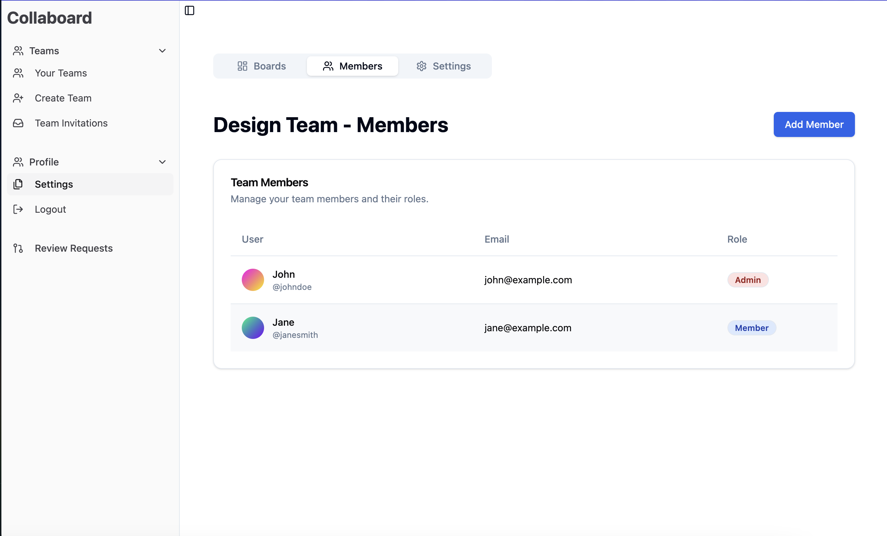
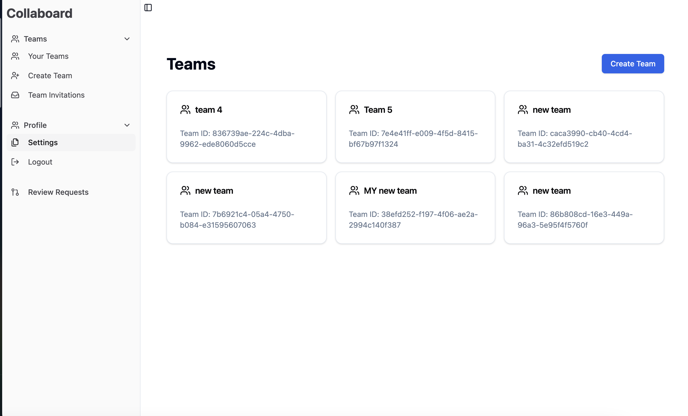
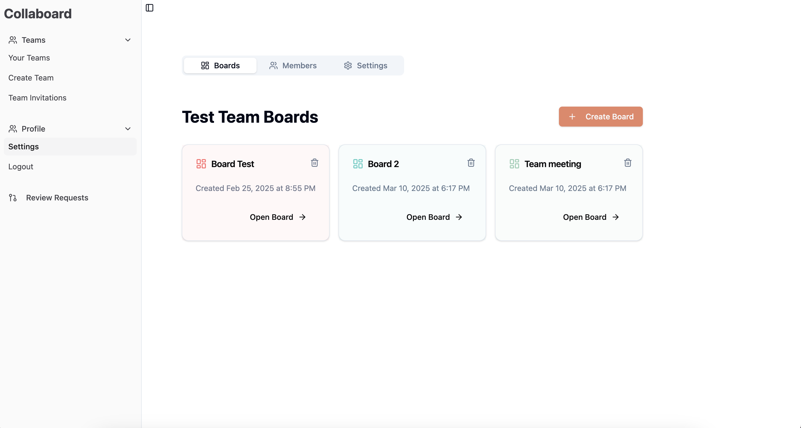
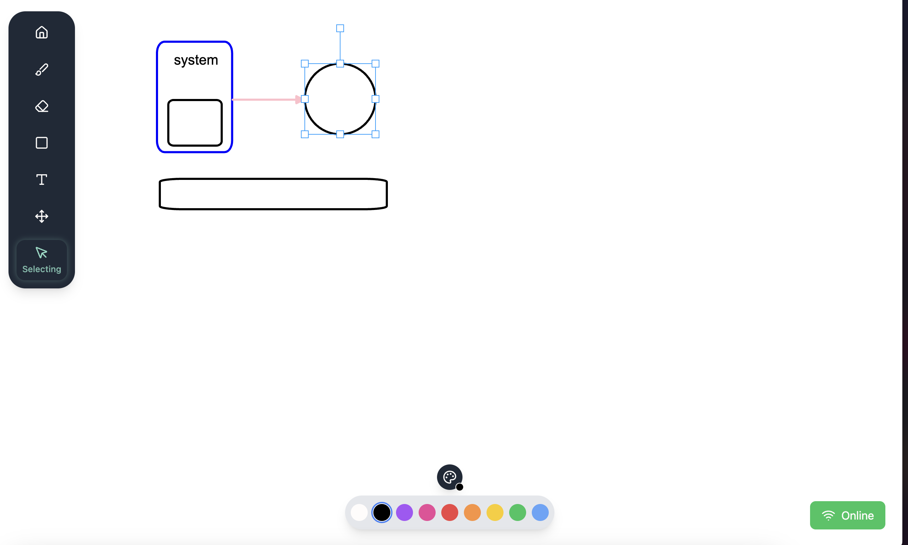

# Collaborative Whiteboard Application

A real-time collaborative whiteboard application that enables teams to work together on shared canvases, with support for offline editing and synchronization. App uses CRDT (Conflict-free Replicated Data Types) for synchronization.

## [Demo Video](video/collaboration_edit.mp4)

## Features

### User Management

- User registration and authentication
- Team creation and management
- Role-based access control (Team Members and Administrators)




### Whiteboard Features

- Real-time collaboration
- Multiple object types support:
  - Lines and shapes (rectangles, ellipses)
  - Text fields
  - Images and icons
- Object manipulation:
  - Move, scale, and rotate
  - Grouping
  - Object locking
- Undo/Redo functionality
- Comments on objects
- Board export to PNG




### Offline Capabilities

- Continued editing without internet connection
- Smart synchronization system
- Merge request workflow for offline changes
- Visual diff comparison for changes
- Review system for offline modifications

### Real-time Collaboration

- Live user presence indicators
- Real-time object editing visualization
- Concurrent editing support
- Active user list

## Quick Start

### Installation

1. Clone the repository

` git clone https://github.com/jmacuga/collaboard.git`

`cd collaboard`

2. Fill in credentials

Add `.env` file based on `.env.example`

2.  Install dependencies

`npm install`

4. Run db server

`docker compose up`

5. Generate prisma client

```
npx prisma generate
```

6. Initialize MariaDB by applying migrations

```
npx prisma migrate dev
```

7. Seed the db

`npx prisma db seed`

8. Run app node.js development server

`npm run dev`

## Architecture

The application is built using:

- Frontend: Next.js 12, React, TypeScript
- Styling: TailwindCSS, shadcn
- Real-time: WebSocket
- Database: MongoDB
- Synchronization: Automerge, Automerge Repo
- Canvas rendering: Konva.js
- Authentication: NextAuth.js

## Project structure

Each directory contains:

- `components/`: React components organized by feature
  - `auth/`: Authentication related components
  - `board/`: Whiteboard and canvas components
  - `boards/` : Team boards view related components
  - `ui/`: Shared UI components
  - `layout/`: Layout components
  - `teams/`: Team management components
- `lib/`: Core functionality
  - `services/`: Services implementing buisiness logic
  - `auth/`: Authentication logic
  - `utils/`: Shared utilities
- `pages/`: Next.js pages and API routes
- `db/`: Database connections and models
- `public/`: Static assets and icons
- `styles/`: Global styles and Tailwind configuration
- `types/`: TypeScript type definitions
